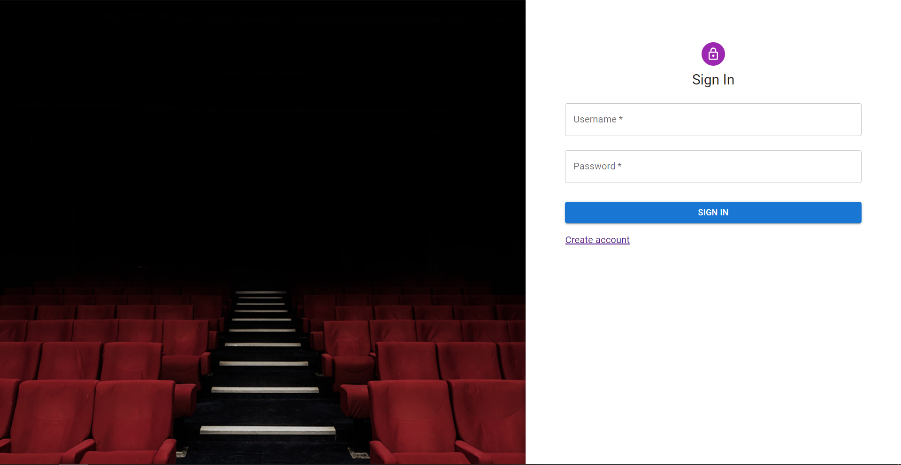

# PAP - Project - Documentation

The application helps employees to manage the cinema and sell tickets.

## Views

### Login view

Login page allows user to perform authorization using JWT tokens.



### Home view

Home page shows interesting statistics with graphs and numbers.


### Cinema view

Cinema page allows user to create, delete and update information about managed cinemas including name, address, phone, email and website.


### Rooms view

Rooms page allows user to create, delete and update information about rooms including room name and number of seats.


### Movies view

Movies page allows user to create, delete and update information about movies including movie title, description, category, length and age restriction.


### Schedule view

Schedule page allows user to schedule movies and specify show's date, time, room, sales open date and sales close date.


### Purchase view

Purchase page allows user to sell tickets. The user can specify scheduled movie, seats, number of tickets from every category. In the last step system shows purchase summary and waits for accepting the payment.


## Environment:
* The application is a web application with a hosted-on service and available 24/7 via the Internet, which contains two parts: Front-end and Back-end, connected by HTTP AJAX requests using JavaScript fetch.
* The backend of the system will be built natively by Java and using Oracle Database via JDBC connection, and serving an HTTP endpoint to work with the front-end.
* Full list of endpoints is available [here](https://gitlab-stud.elka.pw.edu.pl/group-6-pap-bd1/cinema-frontend/-/blob/main/src/utils/endpoints.ts).
* The frontend will be a Single Page Application built with React JS with styling by [mui](https://mui.com/).


## Classes and Model
The project have classes match with table in database, and for each class, have one controller to perform query data and perform actions.

### Main models:
```
- User: id, firstName, lastName, login, password
- Cinema: id, name, address, phoneNumber, email, website, managerId
- Room: id, name, rowsNumber, seatsInRowNumber, cinemaId
- Seat: id, roomId, positionX, positionY, type
- Movie: id, name, description, length, ageRestriction, movieCategoryId, cinemaId
- MovieCategory: id, name, description, cinemaId
- Schedule: id, datetime, filmId, roomId, openSale, closeSale, seatLeft
- Ticket: id, purchaseId, seatId, ticketTypeId
- Purchase: id, datetime, amount, paymentMethod, currency, scheduleId
- TicketType: id, name, price, cinemaId
```

### Other classes:
```
- Functions: Contains functions relating to process data, perform some common action.
- Utils: Contains functions for generic purpose, like encrypt, decrypt, hashing, randomstring, ...
```

## Testing
While building models and functions, we also needed to implement unit testing to make sure the app is working correctly.
- Java Backend: [JUnit 5](https://junit.org/junit5/docs/current/user-guide/)
- React JS: [Puppeteer](https://developers.google.com/web/tools/puppeteer)

## Deployment
The application is deployed to web hosting service (Heroku).
- Backend: https://pwcinema-5c3e9.web.app/

## Repositories
Frontend and backend repositories with running instructions:
- Backend: https://gitlab-stud.elka.pw.edu.pl/group-6-pap-bd1/cinema-backend
- Frontend: https://gitlab-stud.elka.pw.edu.pl/group-6-pap-bd1/cinema-frontend

## Tools
- IntelliJ IDEA
- Git
- VS Code

## Project realization

First, we chose technologies we used in project. We created repositories for both backend and frontend and set up projects. Then we made list of endpoints and tested first requests. We had some problems with CORS policies, but we managed to solve them. We continued to write models and controllers on backend and views on frontend. States in React components started to be complicated, so we had to start using useReducer hook instead of many useState hooks. We had a problem with types in custom genetic useFetch hook, but we made it works. We wrote tests and improved UI. At the end we fixed bugs found in manual tests and created documentation.

## ER Diagram


## Relation Diagram


## Database files
All necessary database files are in /src/main/db_tables. 